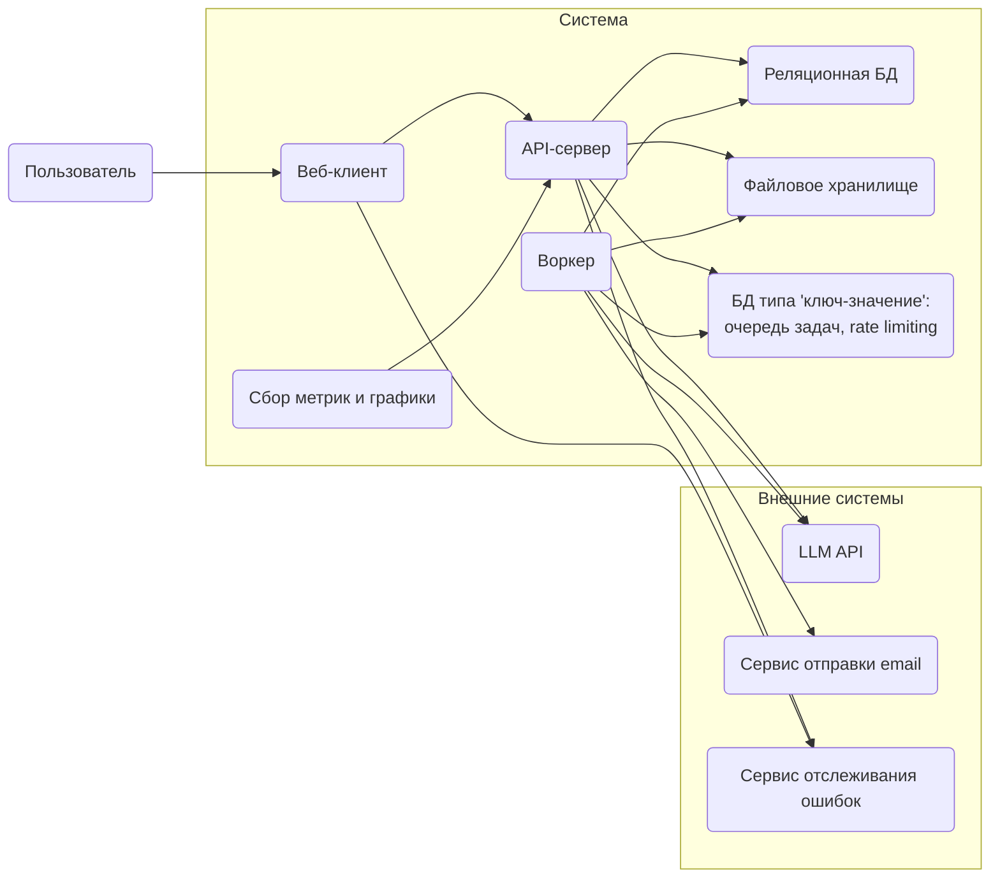
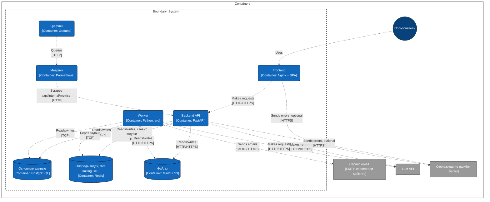
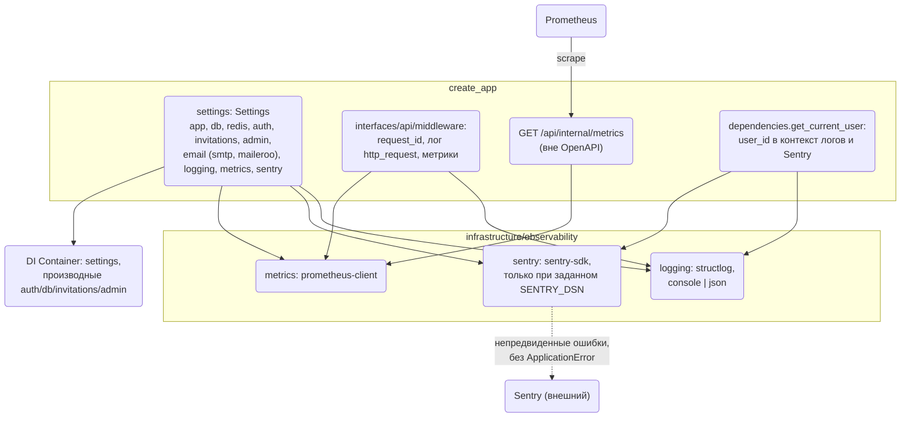
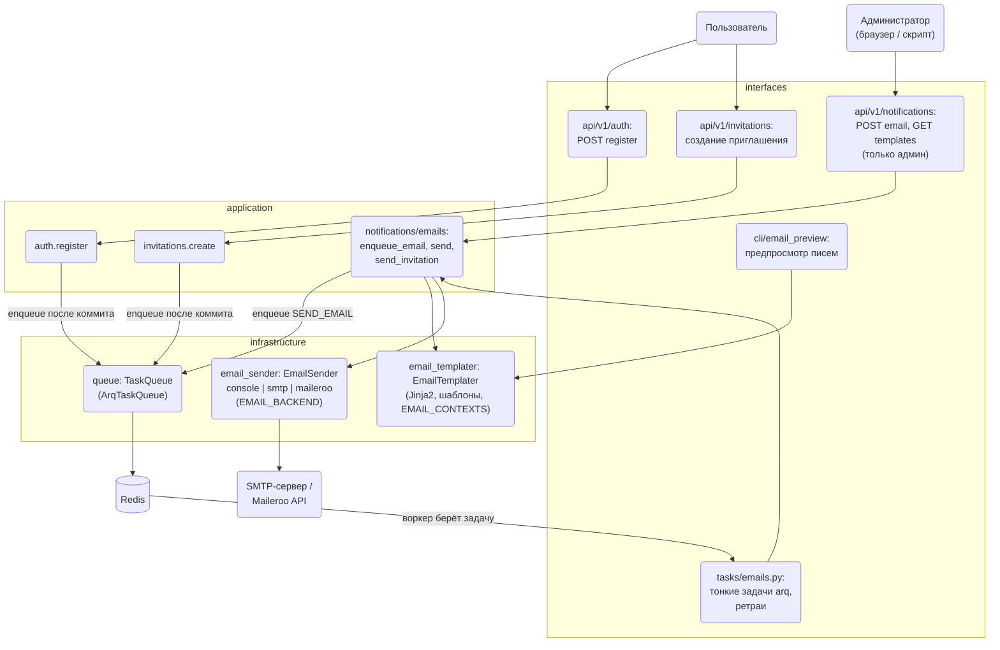

## Архитектура шаблона

Диаграммы - источник истины по составу системы и отправная точка разработки. Новый контейнер, воркер или внешняя интеграция сначала добавляется на диаграммы, и только потом реализуется в коде и в `dev.docker-compose.yml`.

Сейчас показаны компоненты шаблона «из коробки».

### Без технологий

### C4 - уровень контейнеров

### Backend: компоненты наблюдаемости и настройки

Слои — по `backend/AGENTS.md`; `infrastructure` не импортирует `application`.

### Backend: фоновые задачи и письма

Слои — по `backend/AGENTS.md`. `application` не знает про arq и конкретные коннекторы: только интерфейсы `TaskQueue`, `EmailSender`, `EmailTemplater`.

- Письма уходят только из воркера; API лишь ставит задачу в очередь.
- `EMAIL_BACKEND=console` (по умолчанию) пишет письмо в лог; при старте API и воркера выводится предупреждение.
- Добавить коннектор — новый класс `EmailSender`, группа настроек и строка в селекторе DI; добавить письмо — значение `EmailTemplate`, DTO контекста в `EMAIL_CONTEXTS`, папка шаблона.
