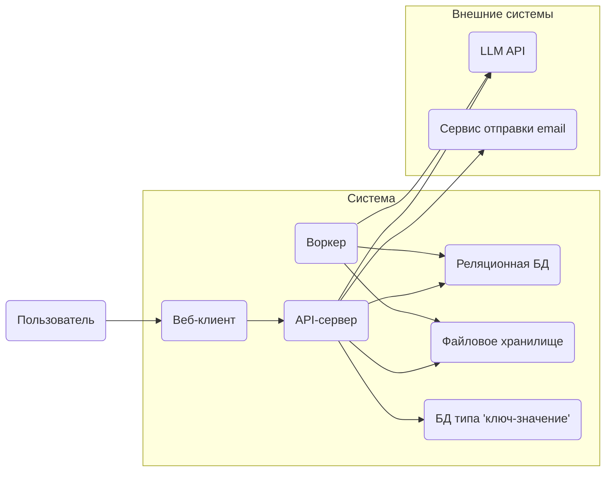
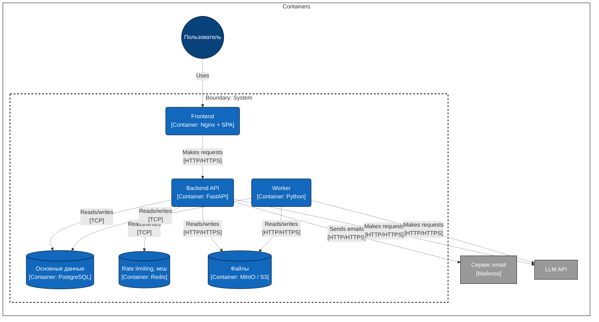

## Архитектура шаблона

Диаграммы - источник истины по составу системы и отправная точка разработки. Новый контейнер, воркер или внешняя интеграция сначала добавляется на диаграммы, и только потом реализуется в коде и в `dev.docker-compose.yml`.

Сейчас показаны компоненты шаблона «из коробки».

### Без технологий

### C4 - уровень контейнеров

