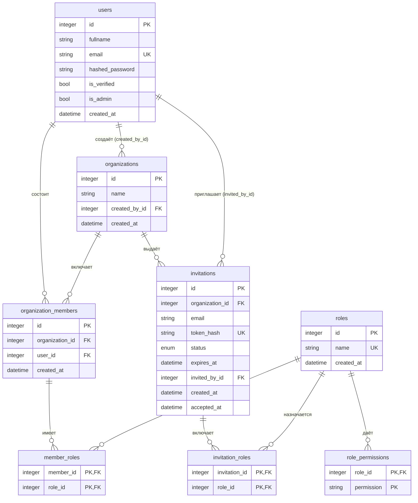

## Модель данных

Эта диаграмма - источник истины по модели данных и отправная точка разработки. Сначала меняется диаграмма (новые сущности, поля, связи, enum), затем по ней пишутся SQLAlchemy-модели, DTO, DAO и миграции. Код должен точно соответствовать диаграмме.

В шаблоне есть пользователи (`users`) и блок организаций: организации, участники, роли, права ролей, приглашения.

Примечания к `users`:
- `email` уникален.
- `is_verified` при создании пользователя равен `true`. Это упрощение шаблона: в реальном проекте здесь должна быть верификация email (письмо со ссылкой), а `is_verified` должен создаваться как `false`.
- `is_admin` по умолчанию `false`, `created_at` заполняется на стороне БД (`now()`). `is_admin` даёт право создавать роли и менять их права; первого администратора назначают вручную в БД.

Примечания к организациям и участникам:
- `organizations.created_by_id` - создатель; в своей организации он проходит любую проверку права без ролей, его нельзя исключить и он не может выйти. Удаление пользователя, создавшего организацию, запрещено (`RESTRICT`).
- При создании организации создателю сразу добавляется запись в `organization_members` (без ролей).
- Пара (`organization_id`, `user_id`) в `organization_members` уникальна. Внешние ключи на организацию и пользователя - `CASCADE`.

Примечания к ролям и правам:
- Роли глобальные (не привязаны к организации); создаёт и меняет их только администратор системы. `name` уникально.
- Права - константы в коде (`Permission`: `members:manage`, `invitations:manage`). В БД хранится только привязка роли к коду права (`role_permissions.permission`); допустимость кода проверяется на уровне приложения, отдельной таблицы справочника нет.
- Эффективные права участника - объединение прав всех его ролей (`member_roles`).
- Внешние ключи на `roles` в `role_permissions`, `member_roles`, `invitation_roles` - `CASCADE`: удаление роли снимает её у участников и из приглашений.

Примечания к приглашениям:
- `status` - enum `pending` / `accepted` / `revoked`. Состояние «истекло» не хранится: это `pending` с `expires_at` в прошлом.
- В БД лежит только хеш токена (`token_hash`, SHA-256); сам токен возвращается один раз при создании.
- Частичный уникальный индекс по (`organization_id`, `email`) при `status = 'pending'`: на email в организации одно действующее приглашение. Просроченные `pending` переводятся в `revoked` при создании нового приглашения на тот же email.
- `accepted_at` заполняется при принятии. Внешние ключи на организацию - `CASCADE`, `invited_by_id` - `SET NULL`.
