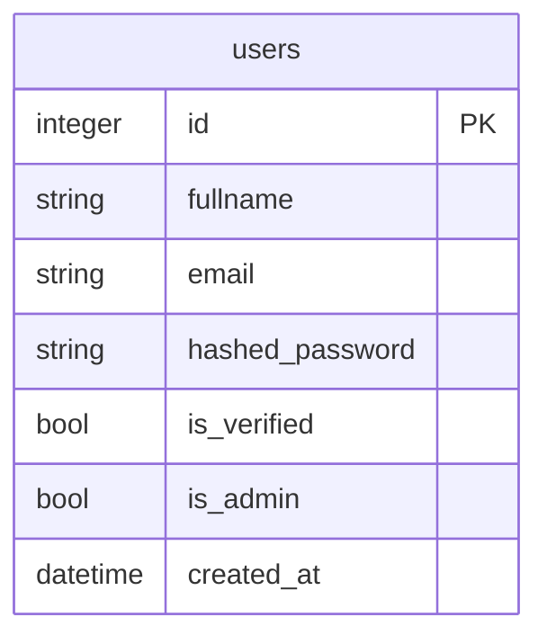

## Модель данных

Эта диаграмма - источник истины по модели данных и отправная точка разработки. Сначала меняется диаграмма (новые сущности, поля, связи, enum), затем по ней пишутся SQLAlchemy-модели, DTO, DAO и миграции. Код должен точно соответствовать диаграмме.

В шаблоне есть одна таблица - `users`.

