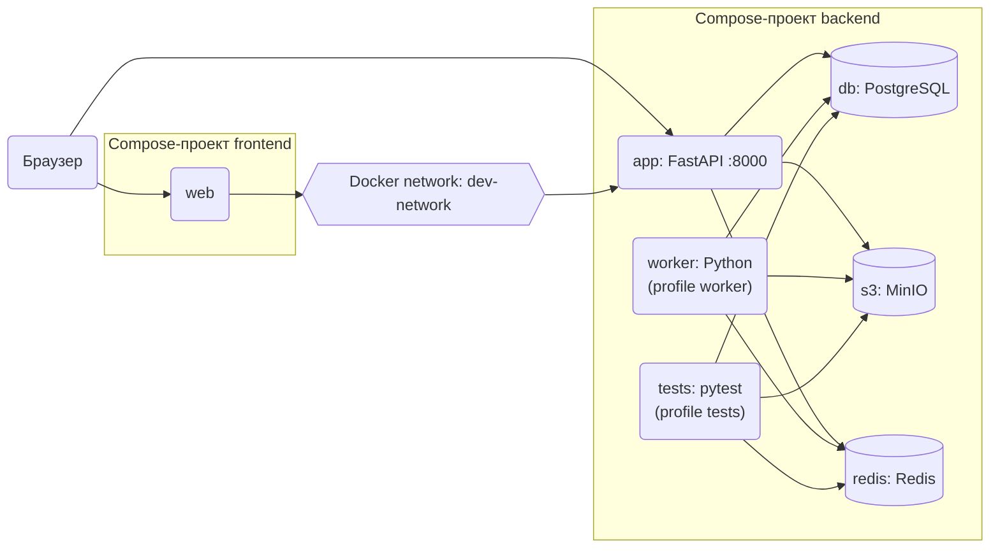
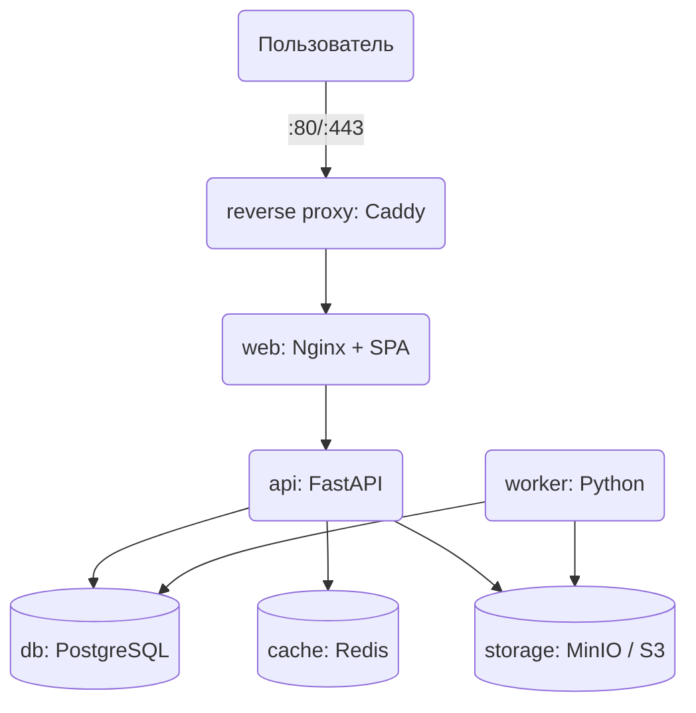

## Модель развертывания

Схемы - источник истины по тому, как система разворачивается. При изменении состава сервисов сначала обновляются схемы, затем `dev.docker-compose.yml` и production-конфигурация.

### Локальная разработка

Описана в `dev.docker-compose.yml`. Frontend запускается отдельным compose-проектом и общается с backend через внешнюю docker-сеть `dev-network`.

В `dev-network` подключен только `app` (алиас `backend`). БД, S3 и Redis недоступны из других проектов и опубликованы на хосте только на `127.0.0.1`.

### Production (ориентир)

Для production в шаблоне пока нет готовых файлов. Рекомендуемая схема для одного сервера в Docker:

При развертывании:
- наружу публикуется только reverse proxy, остальные сервисы доступны во внутренней docker-сети;
- секреты (`AUTH_SECRET_KEY`, `SECURITY_ENCRYPTION_KEY`, пароли БД/Redis/S3) заменяются на уникальные значения, значения из `.example.env` использовать нельзя;
- данные PostgreSQL, MinIO и Redis хранятся в docker-томах с регулярным резервным копированием;
- при необходимости мониторинга добавляются Prometheus, Loki и Grafana, но шаблон их не включает.
