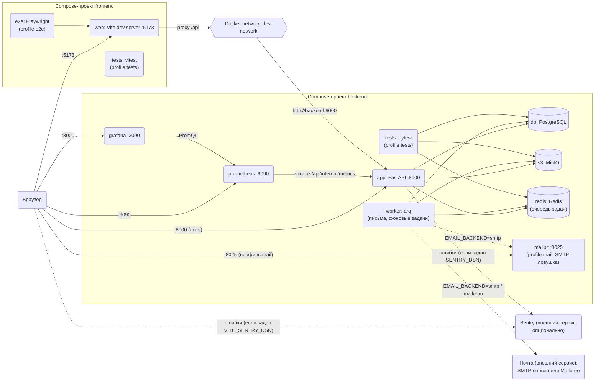
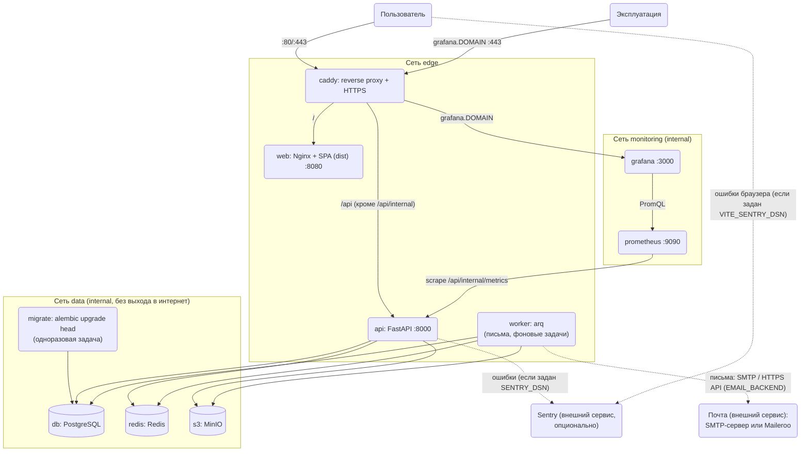

## Модель развертывания

Схемы - источник истины по тому, как система разворачивается. При изменении состава сервисов сначала обновляются схемы, затем `dev.docker-compose.yml` соответствующего проекта (`backend/`, `frontend/`) и production-конфигурация.

### Локальная разработка

Каждый проект описан в своем `dev.docker-compose.yml` и запускается отдельным compose-проектом. Проекты общаются через внешнюю docker-сеть `dev-network`.



- Браузер ходит только на Vite (`:5173`); запросы `/api/*` Vite проксирует на backend, поэтому CORS в dev не нужен.
- В `dev-network` подключен только `app` (алиас `backend`). БД, S3 и Redis недоступны из других проектов и опубликованы на хосте только на `127.0.0.1`.
- `prometheus` и `grafana` запускаются вместе с `app` и опубликованы только на `127.0.0.1` (`:9090`, `:3000`, вход в Grafana `admin/admin`); конфиги — в `.infra/` в корне репозитория. Prometheus опрашивает `app:8000` каждые 15 с; Grafana получает готовый дашборд «HTTP» через provisioning.
- Sentry необязателен: без `SENTRY_DSN` / `VITE_SENTRY_DSN` ничего наружу не отправляется.
- Письма отправляет только `worker` (arq): `app` ставит задачу в Redis, воркер берёт её и отправляет через выбранный `EMAIL_BACKEND` (`console` по умолчанию — письмо пишется в лог воркера, `smtp`, `maileroo`). `worker` запускается вместе с `app` (профиля больше нет). Для проверки SMTP локально: `docker compose --profile mail up -d mailpit`, `EMAIL_BACKEND=smtp`, `EMAIL_SMTP_HOST=mailpit`, `EMAIL_SMTP_PORT=1025`, `EMAIL_SMTP_TLS=none`; письма видны на `http://localhost:8025`. При `EMAIL_BACKEND=console` API и воркер пишут предупреждение о том, что письма не отправляются.

### Production

Production разворачивается на одном сервере через Docker из корня репозитория. Файлы: `prod.docker-compose.yml`, `.infra/Caddyfile`, `.example.env` (шаблон `.env`), `backend/prod.Dockerfile`, `frontend/prod.Dockerfile`, `frontend/nginx.conf`, `.infra/` (конфиги инфраструктуры: Prometheus, Grafana).



Запуск:

```bash
cp .example.env .env              # заполнить все значения <...> уникальными секретами
docker compose up -d --build
```

Безопасность:
- на хосте опубликованы только порты 80 и 443 сервиса `caddy`; БД, Redis и MinIO (в том числе консоль) снаружи недоступны, их сеть `data` помечена `internal` и не имеет выхода в интернет;
- `api` и `worker` подключены к обеим сетям (им нужен доступ к данным и во внешние API; воркеру — ещё и к почтовому серверу/API Maileroo, поэтому он в `edge`), `web` и `caddy` - только к `edge`;
- Caddy автоматически выпускает HTTPS-сертификаты для `DOMAIN`, добавляет security-заголовки и скрывает `/api/internal/*` (healthcheck);
- контейнеры работают без root (кроме штатных образов БД), с `no-new-privileges`, отброшенными capabilities и read-only файловой системой у приложений;
- обязательные секреты заданы без значений по умолчанию (`${VAR:?}`): без заполненного `.env` compose не стартует; `.env` в git не попадает, значения из `.example.env` использовать нельзя;
- API и SPA живут на одном origin, поэтому `VITE_API_URL` остается пустым; в бандл не попадают секреты: всё из `VITE_*` публично;
- миграции применяет сервис `migrate` перед запуском `api` и `worker`;
- данные PostgreSQL, MinIO и Redis хранятся в docker-томах, резервное копирование настраивается отдельно;
- статика SPA кешируется по хешу в имени файла (`/assets/`), `index.html` - без кеша;
- мониторинг: `prometheus` и `grafana` работают в сети `monitoring` (`internal`), порты на хост не публикуются; `api` подключён и к `monitoring`, `grafana` дополнительно к `edge`, чтобы Caddy проксировал её на `grafana.DOMAIN` (нужна DNS-запись; HTTPS автоматически). Вход в Grafana — по логину и паролю из `GRAFANA_ADMIN_USER`/`GRAFANA_ADMIN_PASSWORD` (обязательны), регистрация и анонимный доступ выключены. `/api/internal/*` (health, metrics) снаружи по-прежнему скрыт;
- письма: способ отправки задаёт `EMAIL_BACKEND` (`smtp` или `maileroo`; параметры — `EMAIL_SMTP_*`, `EMAIL_MAILEROO_API_KEY`). Значение по умолчанию `console` на проде означает, что письма не уходят, а пишутся в лог, о чём `api` и `worker` предупреждают при старте. Ссылки в письмах строятся от `APP_BASE_URL` (в compose `https://${DOMAIN}`). Токен приглашения проходит через Redis (сеть `data`, пароль, результаты задач не хранятся);
- логи пишутся в stdout контейнеров (JSON, по одной записи на строку); централизованного хранилища логов (Loki) шаблон не включает;
- Sentry — внешний сервис, подключается только наличием `SENTRY_DSN` (backend) и `VITE_SENTRY_DSN` (frontend, задаётся при сборке образа); в события не попадают email, токены и тела запросов.
