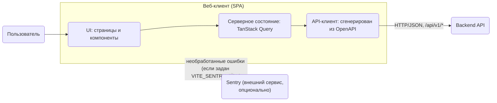
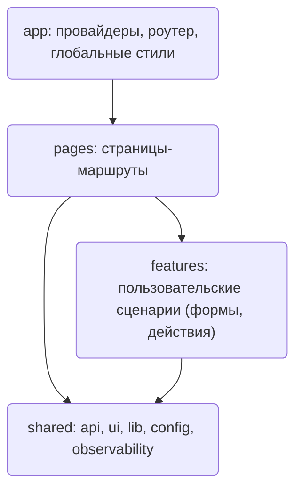
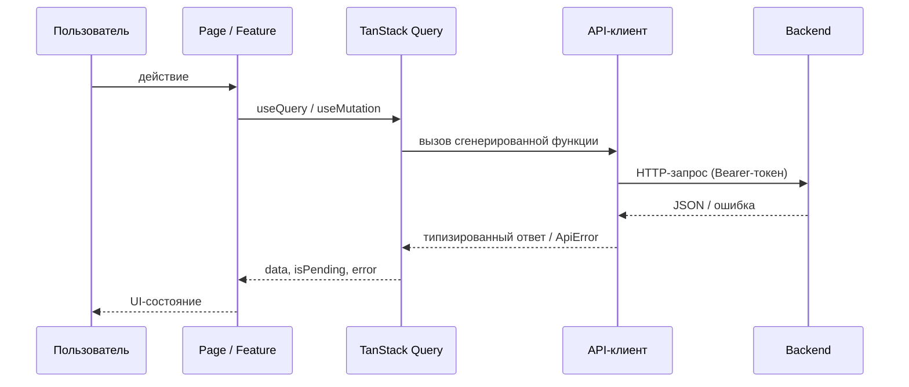

## Архитектура фронтенда

Диаграммы - источник истины по составу клиента и отправная точка разработки. Новая внешняя интеграция или принципиально новый слой сначала добавляется на диаграммы, и только потом реализуется в коде. Общая системная архитектура (backend, БД, воркер) описана в `backend/docs/architecture/architecture.md`.

### Контекст

### Слои

Зависимости направлены только вниз.

`shared/observability` — инициализация Sentry (`initSentry`, вызывается из `app` до рендера) и `setSentryUser` (передаёт только `id`; вызывается из `features/auth`). `app/providers` оборачивает приложение в `Sentry.ErrorBoundary` с fallback «Что-то пошло не так». Ошибки API со статусом < 500 в Sentry не отправляются.

### Поток данных

