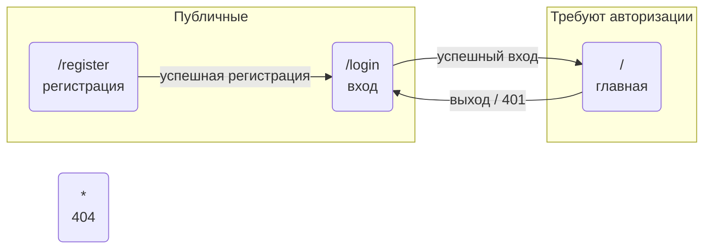

## Маршруты и навигация

Эта диаграмма - источник истины по страницам, маршрутам и правам доступа. Сначала меняется диаграмма (новая страница, переход, ограничение доступа), затем по ней реализуются страницы и роутер. Код должен точно соответствовать диаграмме.

В шаблоне есть страницы аутентификации и главная страница авторизованного пользователя.

Правила доступа:
- неавторизованный пользователь на приватном маршруте перенаправляется на `/login`;
- авторизованный пользователь на `/login` и `/register` перенаправляется на `/`;
- ответ `401` от API сбрасывает сессию и ведёт на `/login`.
