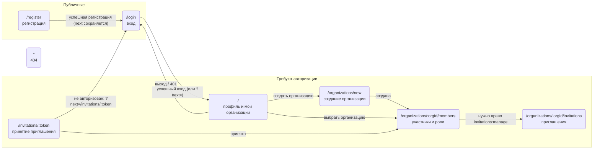

## Маршруты и навигация

Эта диаграмма - источник истины по страницам, маршрутам и правам доступа. Сначала меняется диаграмма (новая страница, переход, ограничение доступа), затем по ней реализуются страницы и роутер. Код должен точно соответствовать диаграмме.

В шаблоне есть страницы аутентификации, главная страница авторизованного пользователя и страницы организаций.

Правила доступа:
- неавторизованный пользователь на приватном маршруте перенаправляется на `/login`; исходный путь передаётся в `?next=`, после входа пользователь возвращается на него (в первую очередь для ссылки приглашения `/invitations/:token`);
- авторизованный пользователь на `/login` и `/register` перенаправляется на `/` (или на `next`);
- ответ `401` от API сбрасывает сессию и ведёт на `/login`;
- `/organizations/:orgId/*` доступны только участникам организации; не участнику показывается «организация не найдена» (API отвечает 404);
- `/organizations/:orgId/invitations` требует права `invitations:manage` (или создателя организации); без права пункт меню скрыт, прямой заход показывает «нет доступа»;
- кнопки смены ролей и исключения на странице участников показываются при праве `members:manage` (или создателе); кнопка «Выйти из организации» - всем, кроме создателя;
- права текущего пользователя в организации берутся из API, а не вычисляются на клиенте; проверка прав всегда выполняется и на backend;
- переключатель организаций в шапке виден на всех приватных страницах; выбранная организация определяется `:orgId` в URL, последняя выбранная запоминается между визитами.
